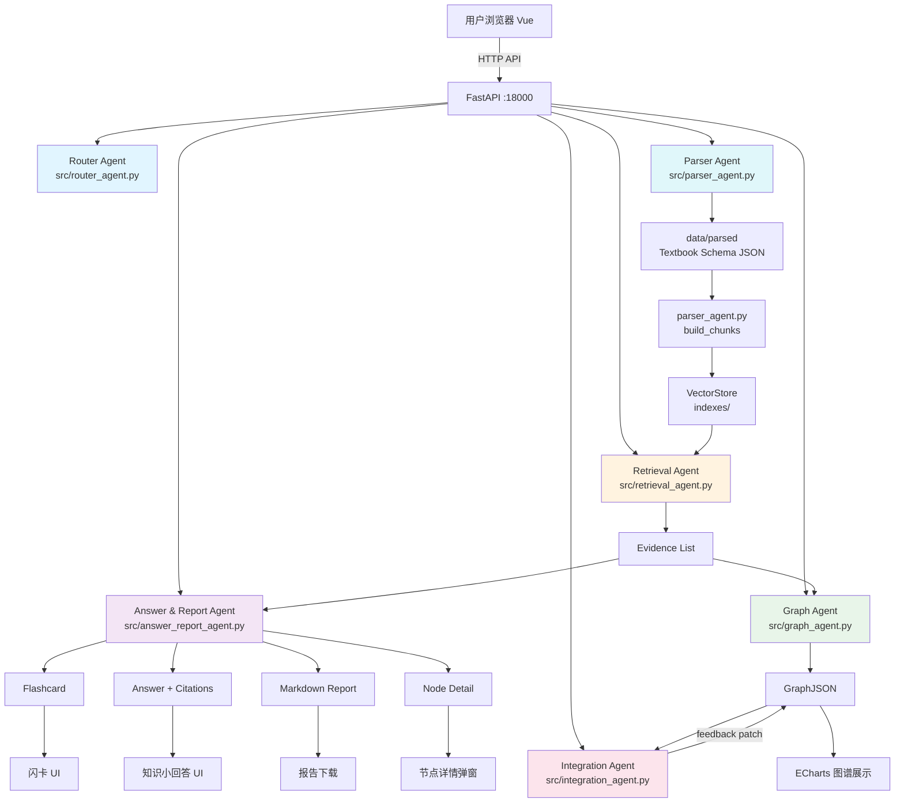

# Agent 架构说明

## 1. 架构总览

HealthPDF Agent 采用 6 个 Agent/Service 组成的混合架构，所有 AI 输出均基于 RAG evidence 检索生成，不允许凭空编造。这一架构既满足了赛题对"多 Agent 协作"的要求，也确保了系统在缺乏教材证据时的可解释性和可靠性。



## 2. 为什么采用多 Agent / 多 Service 架构

### 2.1 赛题任务的复杂性

本题包含多个本质不同的任务：教材解析、RAG 检索、图谱生成、跨教材整合、教师反馈、报告导出。如果将所有逻辑塞入一个 Agent：

1. **Prompt 膨胀**：单一 prompt 需要覆盖所有任务指令，导致上下文耗尽、推理质量下降
2. **职责耦合**：解析逻辑和图谱逻辑混在一起，任何改动都可能影响另一方
3. **幻觉风险**：没有 evidence 约束的单一 Agent 更倾向于编造内容
4. **不可维护**：超过 500 行的单 Agent prompt 几乎无法调试

### 2.2 多 Agent 拆分后的优势

| 优势 | 说明 |
|------|------|
| 职责边界清晰 | 每个 Agent 有明确的输入/输出规范，便于测试和替换 |
| 可独立 fallback | Retrieval Agent 失败时可以 fallback 到 TF-IDF，不影响 Graph Agent |
| RAG evidence 作为统一通信层 | 所有生成类 Agent 都从 Retrieval Agent 获取 evidence，确保引用一致性 |
| 可组合性 | Router 根据用户意图分发到不同 Agent，无需在每个 Agent 内部判断意图 |
| 并行化 | 多个独立的 retrieval 可以并行执行（如跨多本教材时） |

### 2.3 RAG evidence 的核心地位

```
用户问题 → Router（意图识别）
         → Retrieval Agent（RAG 检索）← VectorStore
         → Evidence List（统一的 evidence schema）
         → 分发到不同 Agent
            ├── Answer & Report Agent：生成回答 + 闪卡
            ├── Graph Agent：生成图谱
            └── Integration Agent：整合决策 + 压缩比
```

Retrieval Agent 是所有生成任务的单一入口。任何 Agent 的输出都能通过 evidence_ids 溯源到原始教材的 chunk。

## 3. 各 Agent 职责详解

### 3.1 Router Agent

**文件**：`src/router_agent.py`（第 96-214 行，`RouterAgent` 类）

**输入**：
- `user_query`：用户原始问题
- `current_mode`：当前模式（ask / graph / textbook）
- `history`：对话历史（最近 6 条，用于意图判断）

**输出**：
```python
{
    "intent": "greeting | medical_question | symptom_question | study_question | non_medical_question | unknown",
    "need_pdf_search": bool,
    "user_emotion_reply": str,       # 症状类问题有情绪安抚
    "search_keywords": list[str],    # 最多 12 个
    "expanded_query": str,           # query + keywords + 医学术语
    "answer_focus": str,             # 回答重点提示
    "conversation_goal": str         # 本次对话目标
}
```

**职责**：
1. **意图识别**：区分问候、医学问题、症状问题、学习问题、非医学问题
2. **关键词提取**：从问题中提取医学关键词，并做同义扩展（如"肩膀"→"肩部/肩关节/肩胛区"）
3. **情绪检测**：症状类问题返回安抚话术（`user_emotion_reply`）
4. **拒绝回答**：非医学问题直接标记 `need_pdf_search=False`

**失败兜底**：
- LLM 调用失败时，fallback 到规则引擎（MEDICAL_KEYWORDS / SYMPTOM_KEYWORDS 判断）
- `_fallback_plan` 生成保守但合理的 plan，确保系统不因 LLM 故障而完全不可用

**当前实现状态**：已实现，包含 LLM plan + fallback plan 双轨。

---

### 3.2 Parser Agent

**文件**：
- `src/document_parser.py`：PDF / Markdown / TXT 解析
- `src/parser_agent.py`：`build_chunks_from_textbooks` 函数
- `src/textbook_store.py`：教材 JSON 持久化

**输入**：
- 教材文件路径（PDF / Markdown / TXT）
- 可选：`max_pages_per_pdf`（调试模式限制页数）

**输出**：统一 Textbook Schema

```python
{
    "textbook_id": "病理学_01",
    "filename": "05_病理学.pdf",
    "title": "病理学",
    "format": "pdf",
    "total_pages": 520,
    "total_chars": 385000,
    "chapters": [
        {
            "chapter_id": "ch_001",
            "title": "第四章 炎症",
            "page_start": 78,
            "page_end": 102,
            "content": "...",
            "char_count": 18000
        }
    ]
}
```

**职责**：
1. **多格式解析**：PyMuPDF 逐页读 PDF；Markdown / TXT 按行处理
2. **章节识别**：正则匹配 `第[一二三四五六七八九十百\d]+章` 和 `Chapter \d+`，失败使用"章节待识别"
3. **页码保留**：每段文本标注起始页码，供后续引用溯源
4. **Chunk 生成**：`build_chunks_from_textbooks(chunk_size=700, overlap=80)`，每个 chunk 包含 metadata
5. **持久化**：解析结果保存到 `data/parsed/{textbook_id}.json`

**章节识别限制**：
- 当前依赖正则，对复杂排版（多级目录、合并单元格）的 PDF 效果有限
- 识别失败时该章节标记为"章节待识别"，不阻塞整体流程

**当前实现状态**：已实现，支持 PDF/Markdown/TXT。

---

### 3.3 Retrieval Agent

**文件**：`src/retrieval_agent.py`（第 28-80 行，`RetrievalAgent` 类）

**输入**：
- `query`：搜索 query
- `top_k`：返回数量

**输出**：统一 Evidence List

```python
[
    {
        "evidence_id": "ev_001",
        "book": "病理学",
        "source_file": "05_病理学.pdf",
        "chapter": "第四章 炎症",
        "page": 78,
        "quote": "炎症(inflammation)是机体对损伤...",
        "text": "完整 chunk 文本...",
        "chunk_id": "病理学_01_ch4_p78_c001",
        "score": 0.92,
        "match_type": "hybrid"
    }
]
```

**方法**：

| 方法 | 输入 | 说明 |
|------|------|------|
| `search(query, top_k)` | query, top_k | 通用检索，返回混合检索结果 |
| `search_by_book(topic, per_book_k)` | topic, per_book_k | 每本书取 top-k，保证多书覆盖 |
| `search_for_graph(topic, per_book_k, global_top_k)` | topic, per_book_k, global_top_k | 图谱检索：per_book + 全局合并去重 |
| `search_for_node_detail(node_name, graph_context)` | node_name, graph_context | 节点详情检索 |
| `search_for_report(topic, graph_state)` | topic, graph_state | 报告生成检索，复用 graph.evidence |

**RAG Pipeline 细节**：
- `VectorStore.search_hybrid`：同时使用 embedding 余弦相似度 + TF-IDF BM25，合并评分
- `VectorStore.search_embedding`：纯向量检索，fallback 到 TF-IDF
- `VectorStore.search_tfidf`：纯关键词检索，作为 embedding 不可用时的兜底
- `retrieval_backend` 配置：`hybrid`（默认）/ `embedding` / `tfidf`
- `top_k` 默认 5，可配 1-30；图谱场景 global_top_k=30

**当前实现状态**：已实现，支持 hybrid/embedding/tfidf 三种模式。

---

### 3.4 Graph Agent

**文件**：`src/graph_agent.py`（第 19-135 行，`build_graph` / `update_graph` 函数）

**输入**：
- `topic`：图谱主题
- `evidence`：Retrieval Agent 返回的 evidence list

**输出**：GraphJSON

```python
{
    "topic": "炎症",
    "nodes": [
        {
            "id": "node_001",
            "name": "炎症",
            "type": "concept",
            "level": 0,
            "summary": "炎症是机体对损伤的防御反应...",
            "book_sources": ["病理学", "生理学"],
            "evidence_ids": ["ev_001", "ev_002"],
            "confidence": 0.85,
            "status": "normal",
            "x": None, "y": None
        }
    ],
    "edges": [
        {
            "id": "edge_001",
            "source": "node_001",
            "target": "node_002",
            "relation": "causes",
            "label": "导致",
            "summary": "炎症过程中血管通透性增加导致渗出",
            "evidence_ids": ["ev_003"],
            "confidence": 0.78,
            "status": "normal"
        }
    ],
    "evidence": [...],           # 完整 evidence 列表
    "integration": {
        "overlap_summary": "...",
        "complement_summary": "...",
        "missing_summary": "...",
        "compression": {...}
    },
    "feedback_records": []
}
```

**节点类型**：`concept` / `definition` / `mechanism` / `symptom` / `disease` / `diagnosis` / `treatment` / `risk_factor` / `complication` / `prevention` / `book_specific`

**边关系**：`causes` / `belongs_to` / `associated_with` / `diagnosed_by` / `treated_by` / `complicates` / `prevents` / `explains` / `contrasts_with`

**核心逻辑 `_extract_concepts`**：
1. 初始化 8 个种子概念：定义、病因与危险因素、发生机制、临床表现、诊断依据、治疗与干预、并发症、预防管理
2. 遍历 evidence，对每条文本做 `_classify_text`（关键词匹配机制/诊断/治疗等）
3. 同一类别的 evidence 合并到同一个概念节点
4. `book_sources` 聚合来自不同教材的来源
5. `confidence` 随 evidence 数量递增（每多一本教材 +0.04，上限 0.92）
6. 返回最多 10 个有 evidence 的概念节点

**`update_graph`**：在已有图谱基础上追加新概念节点（来自 followup 的检索结果），生成 patch（added_nodes / added_edges），不重建整图。

**图谱节点绑定 evidence_ids**：每个节点必须绑定至少一个 evidence_id，确保可溯源。无 evidence 的节点在压缩时不保留。

**当前实现状态**：已实现，节点类型和边关系覆盖 10+ 种。

---

### 3.5 Integration Agent

**文件**：`src/integration_agent.py`

**职责**：
1. **跨教材重复分析**（`compare_sources_for_node`）
2. **跨教材互补分析**（`compute_overlap_complement`）
3. **压缩比计算**（`compute_compression_ratio`）
4. **整合摘要生成**（`summarize_integration`）
5. **教师反馈应用**（`apply_teacher_feedback`）

**`summarize_integration(topic, evidence, integrated_text)` 输出**：
```python
{
    "overlap_summary": "围绕"炎症"，当前证据覆盖 2 本教材；多书共同出现的内容可视为重点概念。",
    "complement_summary": "不同教材的片段可互补解释概念定义、机制、病理变化、诊断或防治方向。",
    "missing_summary": "未检索到证据的分支已标注为证据不足，建议继续补充教材或调整检索主题。",
    "compression": {
        "original_chars": 4200,
        "integrated_chars": 1260,
        "compression_ratio": 0.30
    }
}
```

**`apply_teacher_feedback(graph_state, feedback_action)`**：

反馈类型：`keep` / `delete` / `split` / `merge` / `edit`

教师反馈现在包含轻量证据补充闭环：当 `comment` 中出现"补充"、"增加"、"加入"、"完善"、"缺少"、"不完整"等词时，`apply_teacher_feedback` 会基于 `topic + node.name + comment` 构造 query，调用 `RetrievalAgent.search(query, top_k=3)` 检索新的教材 evidence。新增 evidence 会追加到 `graph.evidence`，其 `evidence_id` 会追加到目标节点的 `evidence_ids`，节点摘要会补充"已根据教师反馈补充相关教材证据。"。如果检索失败，系统不会报错，会在 `feedback_record.warning` 中记录"检索失败，已仅记录教师反馈"。

```python
# 输入 feedback_action
{
    "action": "edit",
    "target_type": "node",
    "target_id": "node_003",
    "comment": "缺少炎症介质相关证据，请补充"
}

# 输出
{
    "updated_graph": {...},   # 节点/边状态更新
    "feedback_record": {
        "id": "fb_001",
        "time": "2026-05-10 14:32:00",
        "action": "delete",
        "target_type": "node",
        "target_id": "node_003",
        "comment": "缺少炎症介质相关证据，请补充",
        "retrieval_triggered": true,
        "added_evidence_count": 3,
        "before": {...},
        "after": {...}
    }
}
```

**关键设计**：
- `delete` 操作仅标记 `status: deleted`，不物理删除节点，保留恢复可能
- 每个 feedback 生成带时间戳的 record，可追溯、可审计
- `split` / `merge` 操作标记 `status: highlighted`，等待教师进一步确认
- 证据补充是局部增量更新，不触发全量图谱重建；新增 evidence 通过 `feedback_record` 可审计

**当前实现状态**：已实现，包含压缩比计算和完整反馈流程。

---

### 3.6 Answer & Report Agent

**文件**：`src/answer_report_agent.py`

**方法**：

| 方法 | 输入 | 输出 |
|------|------|------|
| `generate_ask_answer(question, evidence)` | question, evidence | answer + keywords + citations + flashcards + agent_trace |
| `generate_node_detail(node_id, node_name, graph_context, evidence)` | node_id, node_name, graph_context, evidence | node detail + overlap/complement analysis |
| `generate_markdown_report(topic, graph, feedback_records)` | topic, graph, feedback_records | Markdown report text |

**`generate_ask_answer`**：
1. 调用 `extract_keywords` 提取关键词
2. 无 evidence 时返回"教材证据不足"提示
3. 生成回答格式：`围绕"X"，教材证据提示：...；医学安全提示：...`
4. 提取前 6 条 evidence 为 citations（book, chapter, page, quote）
5. 生成 1 张闪卡：title=关键词，definition=首条 quote，key_points=前 3 条 quote，related_terms=其余关键词

**`generate_node_detail`**：
1. 从 graph_context.nodes 找到目标节点
2. 提取节点绑定的 evidence_ids，从 graph_context.evidence 中筛选相关 evidence
3. 调用 `compare_sources_for_node` 生成 overlap / complement 分析
4. 返回定义、详细信息、来源列表、分析文本

**`generate_markdown_report`**：
生成 9 个章节的 Markdown：
1. 核心概念概述
2. 跨教材知识图谱摘要（节点数、边数）
3. 主要节点说明（跳过 deleted）
4. 跨教材重复知识点（integration.overlap_summary）
5. 跨教材互补知识点（integration.complement_summary）
6. 可能缺失或证据不足的部分（integration.missing_summary）
7. 教师反馈记录
8. 压缩比说明
9. 教材引用来源

**当前实现状态**：已实现，包含问答、闪卡、节点详情、报告导出全部功能。

## 4. Agent 之间如何通信

各 Agent 之间通过统一的 Pydantic Schema 通信，确保类型安全和可验证。

### 4.1 统一 Schema

| Schema | 用途 |
|--------|------|
| Textbook | Parser Agent 输出 → 其他 Agent 输入 |
| Chunk | Parser Agent 产出 → VectorStore 索引 |
| Evidence | Retrieval Agent 输出 → 所有生成 Agent 输入 |
| GraphJSON | Graph Agent 输出 → 前端展示 / Integration Agent 输入 |
| FeedbackRecord | Integration Agent 输出 → 写入 GraphJSON |
| Decision | Integration Agent 内部：merge / keep / remove |

### 4.2 数据流中的 Agent 协作

```
用户问"肺炎的症状"
→ Router（意图=medical_question，关键词=["肺炎","症状"]）
→ RetrievalAgent.search("肺炎 症状", top_k=5)
→ Evidence List
→ Answer & Report Agent.generate_ask_answer
→ Answer + Citations + Flashcards
→ 前端展示

用户输入"炎症"进入图谱工作台
→ RetrievalAgent.search_for_graph("炎症", per_book_k=5, global_top_k=30)
→ Evidence List（跨多本书）
→ GraphAgent.build_graph("炎症", evidence)
→ GraphJSON（nodes + edges + evidence + integration）
→ 前端 ECharts 渲染

教师对某节点点击 delete
→ FeedbackRequest（action=delete, target_type=node, target_id=node_003）
→ IntegrationAgent.apply_teacher_feedback
→ updated_graph + FeedbackRecord
→ 前端更新图谱状态
```

### 4.3 Service 层编排

`backend/services.py` 是 Agent 的编排层，将多个 Agent 调用串联成完整的业务流程：

```python
def ask_service(request: AskRequest) -> AskResponse:
    route = route_user_intent(request.question, current_mode="ask")  # Router
    evidence = RetrievalAgent().search(request.question, top_k=request.top_k)  # Retrieval
    payload = generate_ask_answer(request.question, evidence)  # Answer & Report
    return AskResponse(**payload)

def graph_build_service(request: GraphBuildRequest) -> GraphBuildResponse:
    evidence = RetrievalAgent().search_for_graph(request.topic, ...)  # Retrieval
    graph = build_graph(request.topic, evidence)  # Graph
    integration = graph.get("integration", {})
    return GraphBuildResponse(..., integration_summary=...)
```

## 5. RAG Pipeline 设计

### 5.1 分块策略

| 参数 | 值 | 选择依据 |
|------|-----|---------|
| chunk_size | 700 字符 | 医学教材段落较长，完整定义+解释通常 500-700 字；700 能容纳一个独立知识点 |
| overlap | 80 字符 | 防止知识点被块边界截断；80 字约 11% overlap，保证上下文连续性 |
| top_k | 5（默认），可配 1-30 | 保证回答有足够 evidence 又不引入过多噪声 |
| global_top_k | 30（图谱场景） | 跨多本书时需要更多 evidence 才能覆盖不同角度 |

### 5.2 Metadata 设计

每个 chunk 携带完整 metadata，确保引用可溯源：

```python
{
    "chunk_id": "病理学_01_第四章_炎症_p78_c001",
    "textbook_id": "病理学_01",
    "book": "病理学",
    "chapter": "第四章 炎症",
    "page": 78,
    "text": "炎症(inflammation)是..."
}
```

### 5.3 向量检索与 TF-IDF Fallback

```python
class VectorStore:
    def build_index(chunks, use_embedding, backend, ...):
        if backend in {"hybrid", "embedding"}:
            vectors = embed_texts([c["text"] for c in chunks])
            self.faiss_index = faiss.IndexFlatIP(embedding_dim)
            self.faiss_index.add(vectors)

        if backend in {"hybrid", "tfidf"}:
            self.tfidf_matrix = TfidfVectorizer(...).fit_transform(texts)

    def search_hybrid(query, expanded_query, keywords, top_k):
        # embedding 检索
        q_vec = embed_texts([expanded_query])
        embed_results = self.faiss_index.search(q_vec, top_k * 2)

        # TF-IDF 检索
        tfidf_results = self.tfidf_index.search(query, top_k * 2)

        # 合并去重，按 score 排序
        merged = merge_results(embed_results, tfidf_results)
        return merged[:top_k]
```

当 embedding 模型不可用时（首次下载失败 / 网络问题），`retrieval_backend` 自动降级为 `tfidf`，系统仍可正常检索。

### 5.4 防幻觉约束

所有生成类 Agent（Answer & Report / Graph Agent）被强制约束：

1. **JSON 格式约束**：输出必须符合 GraphJSON / Answer Schema，不符合时拒绝
2. **只基于上下文回答**：Prompt 内置"引用来源只能列出检索片段中真实存在的文件名和页码"
3. **引用来源强制要求**：Answer 中必须包含 book + chapter + page + quote
4. **无 evidence 时拒答**：evidence 为空时返回"教材片段中没有找到足够依据"
5. **图谱节点必须绑定 evidence_ids**：没有 evidence_ids 的节点不生成
6. **症状问题禁止诊断**：Prompt 内置"不得输出确定性诊断，不得说'你就是某病'"

### 5.5 Few-shot 设计

Router Agent 使用 `ROUTER_FEW_SHOT_EXAMPLES` 做意图分类示范，覆盖：

- 医学问答：如"肝炎症状有哪些？" → `intent=ask`
- 跨教材图谱：如"帮我生成炎症的跨教材知识图谱" → `graph_mode=integrated`
- 单本教材图谱：如"查看病理学第一章的知识结构" → `graph_mode=single_book`
- 普通问候：如"你好" → `need_retrieval=false`
- 图谱修改：如"把急性炎症和慢性炎症分开，不要合并" → `graph_operation=split`

Router few-shot 不替代规则 fallback。LLM 调用失败、无 API key 或返回非 JSON 时，系统仍使用原规则路由，保证问答链路不因 prompt 失败中断。

Graph Agent 使用 `GRAPH_EXTRACT_FEW_SHOT` 做 evidence → nodes / edges 的抽取示范。示例以"细胞水肿"为输入，展示如何抽取"ATP生成减少"、"钠泵功能障碍"等机制节点，以及 `causes` / `belongs_to` 关系。Graph Agent 仍要求：

- 只根据 evidence 抽取，不编造教材外概念
- 节点必须绑定 `evidence_ids`
- LLM 抽取失败时回退到规则关键词抽取
- `confidence` 优先使用 LLM 输出，缺失时使用默认值

Answer Agent 的 prompt 通过格式指令（format_instruction）控制输出结构；Router 和 Graph 则通过 few-shot + JSON 约束降低幻觉和意图误判。

## 6. 跨教材整合策略

### 6.1 整合流程

```
1. 检索阶段
   RetrievalAgent.search_for_graph(topic, per_book_k=5, global_top_k=30)
   → 跨多本教材的 evidence list

2. 概念提取阶段
   GraphAgent._extract_concepts
   → 按文本类型（机制/诊断/治疗...）聚类 evidence
   → 生成概念节点，每个节点聚合多本教材的同一知识点

3. 对齐阶段
   同名/近义概念 → merge（保留一个节点，book_sources 合并）
   不同类型概念 → keep（各自保留，如"机制"和"治疗"是不同节点）
   confidence < 阈值 → keep（不强制 merge）

4. 决策阶段
   每个节点：merge / keep / remove
   merge：多本书讨论同一概念，合并为一个节点
   keep：概念在不同书中定义/角度不同，保留多本各自节点
   remove：evidence 不足或重复度过高（后续由教师反馈纠正）

5. 压缩比计算
   original_chars = sum(len(ev.quote) for ev in relevant_evidence)
   integrated_chars = sum(len(node.summary) for node in graph.nodes)
   compression_ratio = integrated_chars / original_chars
```

### 6.2 整合决策示例

主题："高血压"

| 节点 | 来源教材 | 类型 | 决策 | 理由 |
|------|---------|------|------|------|
| 高血压定义 | 病理学 + 内科学 | definition | merge | 两本书定义一致，合并 |
| 病理机制 | 病理学 | mechanism | keep | 仅病理学详细描述 |
| 药物治疗 | 内科学 | treatment | keep | 仅内科学详细描述 |
| 危险因素 | 病理学 + 内科学 | risk_factor | merge | 两本书均提到，合并 |
| 并发症 | 内科学 | complication | keep | 两本书侧重点不同，保留各自描述 |

### 6.3 教师反馈修正

```
教师发现"高血压定义"被误合并（病理学讲的是原发性高血压，内科学讲的是继发性高血压）
→ 提交 split 反馈
→ IntegrationAgent 将节点标记为 highlighted
→ 等待教师进一步区分两个子节点
```

## 7. 教师反馈与图谱更新

### 7.1 反馈类型

| 动作 | 节点效果 | 边效果 |
|------|---------|-------|
| keep | `status: normal`，确认保留 | `status: normal` |
| delete | `status: deleted`（不物理删除） | `status: deleted` |
| split | `status: highlighted`，等待进一步编辑 | - |
| merge | `status: highlighted`，等待确认 | `status: deleted` |
| edit | `status: updated`，更新 summary 和 teacher_note | `status: updated` |

### 7.2 Graph Patch 机制

`update_graph` 函数返回 patch，前端可局部更新而不全量刷新：

```python
{
    "added_nodes": [...],
    "added_edges": [...],
    "updated_nodes": [...],
    "highlight_nodes": ["node_005"]
}
```

### 7.3 反馈记录追溯

每个 `FeedbackRecord` 包含完整的 before/after 快照：

```python
{
    "id": "fb_003",
    "time": "2026-05-10 15:42:00",
    "action": "edit",
    "target_type": "node",
    "target_id": "node_007",
    "comment": "该节点定义不准确，应补充说明",
    "before": {"id": "node_007", "name": "心力衰竭", "summary": "..."},
    "after": {"id": "node_007", "name": "心力衰竭", "summary": "心力衰竭是心脏收缩或舒张功能障碍...", "teacher_note": "该节点定义不准确，应补充说明"}
}
```

## 8. 替代方案与取舍

### 8.1 为什么不用完全外部 RAG 平台（如 Qdrant / Milvus）？

**当前方案**：本地 VectorStore（FAISS + TF-IDF）
- 轻量，零部署依赖，适合黑客松现场环境
- TF-IDF fallback 保证网络不佳时仍可用
- 后续可替换为 Qdrant，只需替换 VectorStore 实现，不影响 Agent 层

### 8.2 为什么不用 LangChain？

- LangChain 过度抽象，调试困难，prompt 逻辑隐藏在 chain 内部
- 本题要求"显式 RAG Pipeline"，LangChain 隐藏了实现细节
- 自研 Agent 架构更贴合赛题评分标准（Agent 架构说明）

### 8.3 为什么不用复杂的 Agent 框架（如 AutoGen / CrewAI）？

- 框架增加了不必要的复杂度，引入潜在依赖问题
- 自研 Agent 架构代码量可控（6 个 Agent 文件），便于黑客松现场调试
- Router 分发逻辑用 if-elif 即可，无需复杂的多 Agent 协调协议

### 8.4 为什么不做"任意问题直接生成图谱"，而是区分单本图谱和跨教材整合图谱？

- 单本图谱：学生需要理解某本教材的内部知识结构，来源单一，不需要跨书对齐
- 跨教材整合图谱：教师需要比较多本书的重复/互补，来源多样，需要 merge/keep/remove 决策
- 两个场景的数据流完全不同，单本图谱不需要 Integration Agent 介入

## 9. 已知局限

| 局限 | 影响 | 缓解措施 |
|------|------|---------|
| PDF 章节识别依赖正则 | 复杂排版 PDF 章节可能标记为"章节待识别" | 不阻塞解析；教师可在 TextbookManager 查看页码手动确认 |
| embedding 模型下载需要网络 | 首次运行时若网络不佳，embedding 不可用 | 自动降级到 TF-IDF；后续可预下载模型到本地 |
| 图谱关系抽取依赖规则关键词 | 复杂语义关系可能归类为"相关"而非精确关系 | 教师反馈可修正；后续可引入 LLM 做关系分类 |
| 跨教材节点对齐依赖文本分类 | 同名但不同义的概念可能被误合并 | teacher feedback split 操作可修正；confidence 阈值保底 |
| 压缩比计算基于字符数 | 无法保证语义完整性 | 保留所有节点的 prerequisite 关系；教师反馈可恢复误删节点 |

## 10. 创新点

1. **RAG 统一证据层**：所有生成 Agent（Answer、Graph、NodeDetail、Report）都从同一个 Retrieval Agent 获取 evidence，输出均可溯源至原始教材的 chunk_id

2. **问答与图谱共用 evidence**：用户问一个问题得到回答后，闪卡可跳转进入图谱工作台，使用同一套检索逻辑生成图谱，保证引用一致性

3. **图谱节点绑定引用来源**：每个 GraphNode 包含 `evidence_ids` 和 `book_sources`，点击节点可查看来自哪些教材的哪些页码

4. **教师反馈驱动 graph patch**：教师反馈不触发全量图谱重建，而是生成局部 patch（added_nodes / updated_nodes），保持交互流畅

5. **压缩比与整合决策显式展示**：Integration Agent 显式输出 overlap / complement / missing 分析和 compression_ratio，供教师评估整合质量

6. **双模式产品设计**：
   - 知识小回答：快速、即时的碎片化学习
   - 知识图谱工作台：系统、结构化的知识整合学习
   - 两者之间通过闪卡跳转形成互补的学习路径

## 11. 与评分标准对应关系

| 评分项 | 系统对应实现 | 关键文件 |
|--------|-------------|---------|
| 多格式教材解析 | TextbookManager（前端）+ Parser Agent（后端）+ textbooks_router | `frontend/src/components/TextbookManager.vue`, `src/document_parser.py`, `backend/routers/rag.py` |
| RAG 问答 | RetrievalAgent + generate_ask_answer + RouterAgent | `src/retrieval_agent.py`, `src/answer_report_agent.py`, `src/router_agent.py` |
| 引用来源展示 | Citation schema（book, chapter, page, quote）+ Answer format | `backend/schemas.py`, `src/answer_report_agent.py` |
| 知识图谱（单本） | GraphAgent.build_graph + GraphCanvas + ECharts | `src/graph_agent.py`, `frontend/src/components/GraphCanvas.vue` |
| 跨教材整合图谱 | RetrievalAgent.search_for_graph（per_book_k）+ Integration Agent | `src/retrieval_agent.py:search_for_graph`, `src/integration_agent.py` |
| 图谱交互 | ECharts（节点拖拽/缩放/点击）+ NodeDetailPanel | `frontend/src/components/GraphCanvas.vue`, `frontend/src/components/NodeDetailPanel.vue` |
| 教师反馈 | apply_teacher_feedback + graph patch + FeedbackRecord | `src/integration_agent.py:apply_teacher_feedback` |
| 整合报告 | generate_markdown_report（9 个章节） | `src/answer_report_agent.py:generate_markdown_report` |
| Agent 架构 | 6 Agent 协作 + 统一 Schema + RAG evidence 层 | 本文档 |
| 压缩比展示 | compute_compression_ratio + integration_summary | `src/integration_agent.py:compute_compression_ratio` |
| 闪卡生成 | generate_ask_answer 内置 flashcards 生成 | `src/answer_report_agent.py:generate_ask_answer` |
| 状态监控 | /api/status + IndexStatusCard | `backend/main.py:get_status`, `frontend/src/components/IndexStatusCard.vue` |

## 12. 本轮提分项补充

### 12.1 Prompt 工程增强

`src/prompts.py` 中显式维护 `ROUTER_FEW_SHOT_EXAMPLES`，覆盖 5 类高频输入：

- 医学问答：`肝炎症状有哪些？` → `intent=ask`
- 跨教材图谱：`帮我生成炎症的跨教材知识图谱` → `graph_mode=integrated`
- 单本教材图谱：`查看病理学第一章的知识结构` → `graph_mode=single_book`
- 普通问候：`你好` → `need_retrieval=false`
- 图谱修改：`把急性炎症和慢性炎症分开，不要合并` → `graph_operation=split`

Router Agent 在调用 LLM 时将 few-shot examples 拼入 prompt，用示例约束 intent、topic、keywords、need_retrieval 等字段，减少“问答 / 图谱 / 图谱更新”之间的误判。LLM 调用失败、无 API key 或返回非 JSON 时，仍回退到原规则路由。

`GRAPH_EXTRACT_FEW_SHOT` 包含 3 个医学图谱抽取示例：

- 细胞水肿：抽取 `pathological_change`、`mechanism`，关系包括 `causes`、`belongs_to`
- 炎症：抽取 `concept`、`cause`、`pathological_change`，关系包括 `causes`、`contains`
- 肿瘤：抽取 `disease`、`cause`、`mechanism`，关系包括 `causes`、`explains`、`is_a`

Graph Agent 将该 few-shot 接入 LLM 抽取 prompt，要求返回 `nodes` 和 `edges` JSON。节点 `confidence` 优先采用 LLM 输出；缺失时使用默认值。节点仍必须绑定 `evidence_ids`，无法绑定 evidence 的节点会被丢弃。LLM 失败或格式错误时保留规则 fallback。

### 12.2 教师反馈 evidence 闭环

教师反馈不再只是记录状态。当 comment 中出现“补充 / 增加 / 加入 / 完善 / 缺少 / 不完整”等词时：

1. `apply_teacher_feedback` 使用 `graph.topic + node.name + comment` 构造 query。
2. 调用 `RetrievalAgent.search(query, top_k=3)` 进行轻量检索。
3. 新 evidence 追加到 `graph.evidence`。
4. 新 `evidence_id` 绑定到目标节点 `evidence_ids`。
5. `node.summary` 追加“已根据教师反馈补充相关教材证据。”
6. `feedback_record` 记录 `retrieval_triggered`、`added_evidence_count`、`target_id`。
7. 前端显示“已根据教师反馈追加 N 条教材 evidence。”

如果检索失败或没有索引，系统不会报错，会记录 warning 并保留原教师反馈功能。

### 12.3 部署与工程质量

- Docker + docker-compose：根目录提供后端 `Dockerfile`、`frontend/Dockerfile` 和 `docker-compose.yml`，支持 `docker compose up -d --build` 一键启动。
- requirements 版本锁定：`requirements.txt` 使用 pinned versions，降低评审环境复现风险。
- DOCX 解析支持：`src/document_parser.py::parse_docx` 使用 `python-docx` 读取 Heading 1/2 和“标题 1/2”，输出统一 textbook/chapter/pages 结构。
- pytest 单元测试：`tests/test_chunker.py` 和 `tests/test_integration.py` 覆盖 chunk 切分、overlap 校验、压缩比和教师反馈 edit/delete 分支。
- 样例报告：`report/sample_integration_炎症.md` 展示跨教材整合报告格式。
