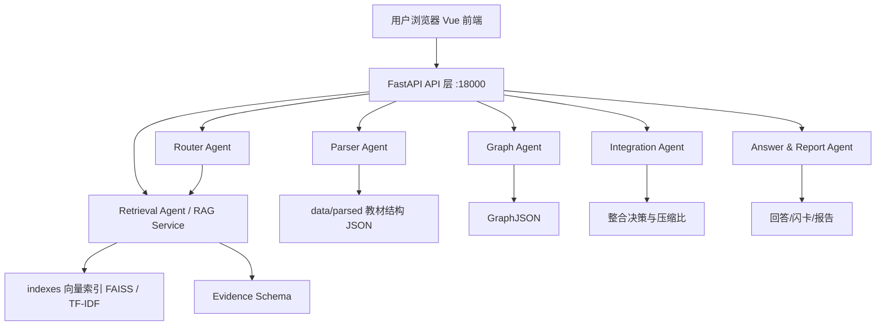

# 系统设计

## 1. 系统总体架构

系统采用 Vue 3 前端 + FastAPI 后端 + Agent/Service 层 + RAG 证据层的分层架构。



### 架构说明

- **前端**：Vue 3 + Vite + Ant Design Vue + ECharts，运行于 15173 端口
- **后端**：FastAPI + Pydantic，运行于 18000 端口
- **Agent 层**：6 个 Agent/Service（Router、Parser、Retrieval、Graph、Integration、Answer & Report）
- **RAG 层**：VectorStore（FAISS/TF-IDF）+ chunk metadata
- **LLM**：ModelScope OpenAI-compatible API（Qwen3-235B-A22B）

### 前端模块结构

| 组件 | 职责 |
|------|------|
| LayoutShell | 全局布局 + 模式切换（textbook/ask/graph） |
| TextbookManager | 教材上传/解析/索引状态展示 |
| AskMode | 知识小回答 + 闪卡生成 |
| GraphWorkspace | 知识图谱工作台（单本/跨教材） |
| GraphCanvas | ECharts 图谱渲染 + 交互 |
| SankeyEvidenceFlow | RAG 证据流桑基图（教材 → 章节 → 节点类型） |
| NodeDetailPanel | 节点详情弹窗 |
| FeedbackPanel | 教师反馈表单 |
| FlashcardPanel | 闪卡展示 + 跳转图谱 |
| ReportExporter | Markdown 报告导出 |

### 后端模块结构

| 文件 | 职责 |
|------|------|
| backend/main.py | FastAPI app、路由注册、健康检查 |
| backend/schemas.py | 所有请求/响应 Pydantic 模型 |
| backend/services.py | 所有业务逻辑 service 函数 |
| backend/routers/rag.py | textbooks_router + rag_router |
| src/router_agent.py | RouterAgent.plan_user_query |
| src/parser_agent.py | build_chunks_from_textbooks |
| src/retrieval_agent.py | RetrievalAgent.search 系列方法 |
| src/graph_agent.py | build_graph / update_graph |
| src/integration_agent.py | apply_teacher_feedback / summarize_integration |
| src/answer_report_agent.py | generate_ask_answer / generate_markdown_report |
| src/vector_store.py | VectorStore（FAISS/TF-IDF） |
| src/config.py | Settings / env var 读取 |

## 2. 前端设计

### 2.1 技术栈

- Vue 3 Composition API + `<script setup>`
- Vite 5 构建工具
- Ant Design Vue 4.x 组件库
- ECharts 5.x 图谱渲染
- TypeScript 类型安全
- Axios HTTP 客户端

### 2.2 页面结构

```
App.vue
├── LayoutShell（模式切换 header + 侧边/主体布局）
│   ├── TextbookManager（mode === 'textbook'）
│   ├── AskMode（mode === 'ask'）
│   │   ├── ChatPanel（输入问题）
│   │   ├── RetrievedChunksPanel（检索证据）
│   │   └── FlashcardPanel（右侧闪卡）
│   └── GraphWorkspace（mode === 'graph'）
│       ├── ModeSwitcher（单本/跨教材 Tab）
│       ├── GraphCanvas（ECharts 渲染）
│       ├── NodeDetailPanel（节点详情弹窗）
│       ├── FeedbackPanel（教师反馈）
│       └── ReportExporter（报告导出）
```

### 2.3 图谱交互设计

- **节点点击**：弹出 NodeDetailPanel，显示定义、详细信息、来源教材、overlap/complement 分析
- **节点拖拽**：释放后更新节点 x/y 坐标
- **缩放**：ECharts 内置 zoom + pan
- **边点击**：显示边的 summary 和 evidence_ids

## 3. 后端设计

### 3.1 技术栈

- FastAPI 0.115+（异步支持、类型校验、自动文档）
- Pydantic v2（数据模型）
- uvicorn（ASGI 服务器）
- sentence-transformers（BGE embedding，本地优先）
- faiss-cpu（向量索引）
- scikit-learn（TF-IDF fallback）
- httpx + openai（ModelScope API 调用）

### 3.2 路由设计

| 路由 | 说明 |
|------|------|
| `backend/routers/rag.py::textbooks_router` | `/api/textbooks/*` 教材管理 |
| `backend/routers/rag.py::rag_router` | `/api/rag/*` RAG 操作 |
| `backend/routers/ask.py` | `/api/ask` 知识小回答 |
| `backend/routers/graph.py` | `/api/graph/build`、`/api/graph/update`、`/api/graph/node-detail` |
| `backend/routers/feedback.py` | `/api/feedback` 教师反馈 |
| `backend/routers/report.py` | `/api/report/export` 报告导出 |

### 3.3 Service 层职责

所有业务逻辑集中在 `backend/services.py`，通过 Pydantic schema 做输入输出校验：

| Service | 调用链 |
|---------|--------|
| `get_status` | 读取 index metadata，返回系统状态 |
| `build_index_service` | build_chunks → VectorStore.build_index → save |
| `ask_service` | RouterAgent → RetrievalAgent.search → generate_ask_answer |
| `graph_build_service` | RetrievalAgent.search_for_graph → build_graph |
| `graph_update_service` | RetrievalAgent.search → update_graph |
| `node_detail_service` | RetrievalAgent.search_for_node_detail → generate_node_detail |
| `feedback_service` | apply_teacher_feedback |
| `report_export_service` | generate_markdown_report |

## 4. 数据流

### 4.1 教材上传与解析流程

```
1. 用户在前端 TextbookManager 点击上传
2. POST /api/textbooks/upload → 保存到 uploads/textbooks/{filename}
3. POST /api/textbooks/parse → Parser Agent 解析文件
   - PDF: document_parser.py → PyMuPDF 逐页读文本
   - Markdown/TXT: 原始文本按行读取
4. 输出: data/parsed/{textbook_id}.json（Textbook Schema）
   {
     textbook_id, filename, title, format,
     total_pages, total_chars, chapters[]
   }
5. 前端展示文件列表和章节树
```

### 4.2 RAG 索引流程

```
1. build_index_service 触发
2. 从 data/parsed/ 读取所有已解析教材
3. parser_agent.build_chunks_from_textbooks
   - chunk_size=700, overlap=80
   - metadata: book, chapter, page, chunk_id
4. VectorStore.build_index
   - retrieval_backend=hybrid: 同时构建 embedding + TF-IDF
   - retrieval_backend=embedding: 仅 embedding
   - retrieval_backend=tfidf: 仅 TF-IDF
5. 保存 indexes/healthpdf_index.pkl
6. /api/status 返回 chunk_count、retrieval_backend
```

### 4.3 知识小回答流程

```
1. 用户在 AskMode 输入问题
2. POST /api/ask → ask_service
3. RouterAgent.plan_user_query
   - 判断 intent（greeting/medical_question/symptom_question...）
   - 提取 search_keywords
   - 生成 expanded_query
4. RetrievalAgent.search(query, top_k)
   - 加载 VectorStore
   - hybrid/tfidf/embedding 检索
   - 返回 evidence list（每条含 evidence_id, book, chapter, page, quote）
5. generate_ask_answer(question, evidence)
   - 提取关键词
   - 生成简洁回答 + 教材依据 + 引用来源 + 医学安全提示
   - 生成 flashcards（title, definition, key_points, related_terms）
6. 返回 AskResponse（answer, keywords, citations, flashcards, agent_trace）
```

### 4.4 单本教材图谱流程

```
1. 用户在 GraphWorkspace 选择教材 + 章节
2. POST /api/graph/build → graph_build_service
3. RetrievalAgent.search_for_graph(topic, per_book_k=5, global_top_k=30)
   - search_by_book: 每本书取 top-k evidence
   - 合并 + 去重
   - 每个 evidence 分配 evidence_id
4. GraphAgent.build_graph(topic, evidence)
   - _extract_concepts: 按文本类型（机制/诊断/治疗/并发症...）聚类
   - 生成 nodes: id, name, type, summary, book_sources, evidence_ids, confidence
   - 生成 edges: id, source, target, relation, label, summary, evidence_ids
   - 生成 graph_evidence: 每个 evidence 保留完整引用信息
   - 调用 summarize_integration: 计算 compression_ratio
5. 返回 GraphBuildResponse（topic, graph, evidence, integration_summary, agent_trace）
```

### 4.5 跨教材整合流程

```
1. 用户输入主题，选择多本教材或"全部教材"
2. POST /api/graph/build（global_top_k=30）
3. RetrievalAgent.search_for_graph 跨多本书检索
4. GraphAgent.build_graph
   - 每个概念节点可能来源于多本教材（book_sources > 1）
   - 同名/近义概念自动对齐（_classify_text 规则）
   - 整合决策默认 merge（同名节点保留），confidence 低于阈值时 keep
5. Integration Agent 的 summarize_integration 计算：
   - overlap_summary: "围绕 X，证据覆盖 N 本教材"
   - complement_summary: "不同教材从定义/机制/临床表现/诊断角度互补"
   - missing_summary: "未检索到证据的分支标注为证据不足"
   - compression: original_chars / integrated_chars
6. 返回含 integration 字段的 GraphBuildResponse
```

### 4.6 教师反馈流程

```
1. 用户在图谱界面点击节点/边，填写反馈（keep/delete/split/merge/edit）
2. POST /api/feedback → feedback_service
3. apply_teacher_feedback(graph, feedback_action)
   - 遍历 nodes/edges 找到 target_id
   - 更新 status（deleted/updated/highlighted）
   - 记录 teacher_note
   - 生成 FeedbackRecord（id, time, action, target_type, target_id, comment, before, after）
   - 追加到 graph.feedback_records
4. 返回 FeedbackResponse（success, updated_graph, feedback_record）
```

### 4.7 Markdown 报告导出流程

```
1. 用户点击"导出报告"
2. POST /api/report/export → report_export_service
3. generate_markdown_report(topic, graph, feedback_records)
   - 遍历 graph.nodes 生成节点说明
   - 写入 integration 字段的 overlap/complement/missing summary
   - 写入所有 feedback_records
   - 写入 compression 详情
   - 写入所有 evidence 来源引用
4. 返回 ReportExportResponse（markdown, filename）
5. 前端触发下载
```

## 5. 核心数据结构

### 5.1 Textbook Schema

```python
{
    "textbook_id": "病理学_01",
    "filename": "05_病理学.pdf",
    "title": "病理学",
    "format": "pdf",
    "total_pages": 520,
    "total_chars": 385000,
    "chapters": [
        {
            "chapter_id": "ch_001",
            "title": "第四章 炎症",
            "page_start": 78,
            "page_end": 102,
            "content": "...",
            "char_count": 18000
        }
    ]
}
```

### 5.2 Chunk Schema

```python
{
    "chunk_id": "病理学_01_ch4_p78_c001",
    "textbook_id": "病理学_01",
    "book": "病理学",
    "chapter": "第四章 炎症",
    "page": 78,
    "text": "炎症(inflammation)是...",
    "char_count": 680
}
```

### 5.3 Evidence Schema

```python
{
    "evidence_id": "ev_001",
    "book": "病理学",
    "source_file": "05_病理学.pdf",
    "chapter": "第四章 炎症",
    "page": 78,
    "quote": "炎症(inflammation)是机体对损伤...",
    "text": "完整 chunk 文本...",
    "chunk_id": "病理学_01_ch4_p78_c001",
    "score": 0.92,
    "match_type": "hybrid"
}
```

### 5.4 GraphJSON Schema

```python
{
    "topic": "炎症",
    "nodes": [
        {
            "id": "node_001",
            "name": "炎症",
            "type": "concept",
            "level": 0,
            "summary": "炎症是机体对损伤的防御反应...",
            "book_sources": ["病理学", "生理学"],
            "evidence_ids": ["ev_001", "ev_002"],
            "confidence": 0.85,
            "status": "normal",
            "x": None, "y": None
        }
    ],
    "edges": [
        {
            "id": "edge_001",
            "source": "node_001",
            "target": "node_002",
            "relation": "causes",
            "label": "导致",
            "summary": "炎症过程中血管通透性增加导致渗出",
            "evidence_ids": ["ev_003"],
            "confidence": 0.78,
            "status": "normal"
        }
    ],
    "evidence": [...],
    "integration": {
        "overlap_summary": "围绕"炎症"，证据覆盖 2 本教材",
        "complement_summary": "不同教材从机制/临床表现/治疗角度互补",
        "missing_summary": "预防管理部分证据不足",
        "compression": {
            "original_chars": 4200,
            "integrated_chars": 1260,
            "compression_ratio": 0.30
        }
    },
    "feedback_records": [...]
}
```

### 5.5 FeedbackRecord Schema

```python
{
    "id": "fb_001",
    "time": "2026-05-10 14:32:00",
    "action": "delete",
    "target_type": "node",
    "target_id": "node_003",
    "comment": "该节点证据不足，删除",
    "before": {"id": "node_003", "name": "...", "status": "normal"},
    "after": {"id": "node_003", "name": "...", "status": "deleted"}
}
```

## 6. API 接口一览

| 方法 | 路径 | 请求体 | 响应 | 说明 |
|------|------|--------|------|------|
| GET | /api/health | - | HealthResponse | 健康检查 |
| GET | /api/status | - | StatusResponse | 系统状态 |
| POST | /api/textbooks/upload | multipart | TextbookUploadResponse | 上传教材文件 |
| GET | /api/textbooks | - | list[TextbookSummary] | 列出所有教材 |
| POST | /api/textbooks/parse | TextbookParseRequest | TextbookParseResponse | 解析教材 |
| GET | /api/textbooks/{textbook_id} | - | TextbookDetail | 教材详情 |
| POST | /api/rag/index | RAGIndexRequest | RAGIndexResponse | 构建 RAG 索引 |
| GET | /api/rag/status | - | RAGStatusResponse | RAG 状态 |
| POST | /api/rag/query | RAGQueryRequest | RAGQueryResponse | RAG 问答查询 |
| POST | /api/index/build | IndexBuildRequest | IndexBuildResponse | 索引构建 |
| POST | /api/ask | AskRequest | AskResponse | 知识小回答 |
| POST | /api/graph/build | GraphBuildRequest | GraphBuildResponse | 构建图谱 |
| POST | /api/graph/update | GraphUpdateRequest | GraphUpdateResponse | 更新图谱 |
| POST | /api/graph/node-detail | NodeDetailRequest | NodeDetailResponse | 节点详情 |
| POST | /api/feedback | FeedbackRequest | FeedbackResponse | 教师反馈 |
| POST | /api/report/export | ReportExportRequest | ReportExportResponse | 导出报告 |
| POST | /api/chat | ChatRequest | ChatResponse | 兼容旧版 chat UI |

## 7. 技术选型理由

| 技术 | 选型 | 理由 |
|------|------|------|
| FastAPI | 后端框架 | 开发速度快、自动文档、类型安全、异步支持 |
| Pydantic | 数据校验 | v2 性能好、与 FastAPI 深度集成 |
| Vue 3 + Vite | 前端框架 | 组合式 API适合复杂状态、<script setup> 语法简洁、Vite HMR 快 |
| Ant Design Vue | UI 组件 | 医疗/教育风格适合、组件丰富、文档完善 |
| ECharts | 图谱渲染 | 国产稳定、交互丰富、支持大型图谱、Vue 封装方便 |
| PyMuPDF (fitz) | PDF 解析 | 速度快、Python 原生、跨平台 |
| sentence-transformers | Embedding | BGE-small-zh-v1.5 中文效果好、CPU 可跑 |
| FAISS | 向量索引 | Meta 开源、轻量、Inverted Index 适合 RAG |
| scikit-learn | TF-IDF fallback | 成熟稳定、sklearn 生态、无外部依赖 |
| ModelScope API | LLM | 比赛提供额度、OpenAI-compatible、Qwen3-235B 效果好 |

## 8. 错误处理与降级策略

| 场景 | 处理方式 |
|------|---------|
| API key 缺失 | `has_api_key()` 返回 False，前端提示配置 key；service 层返回友好错误信息而非 500 |
| embedding 模型下载失败 | 降级到 TF-IDF；`retrieval_backend=tfidf` 写入 config |
| FAISS 不可用 | `VectorStore.build_index` 捕获异常，回退到纯 TF-IDF |
| PDF 章节识别失败 | 正则匹配不到时使用"章节待识别"；不阻塞整个解析流程 |
| 无 RAG evidence | `generate_ask_answer` 返回"教材证据不足"提示；不幻觉 |
| LLM 返回非 JSON | `router_agent._extract_json` 用正则提取；失败走 fallback plan |
| 图谱节点 evidence_ids 为空 | `generate_node_detail` 返回"可继续检索补充该节点证据" |
| 教师反馈 target 不存在 | `apply_teacher_feedback` 遍历后无匹配则跳过，记录 warning |
| 向量索引损坏 | `VectorStore.load_index` 检查完整性，损坏则建议重建索引 |

## 9. 部署设计

### 9.1 当前端口配置

| 服务 | 端口 | 启动命令 |
|------|------|---------|
| 后端 FastAPI | 18000 | `uvicorn backend.main:app --host 0.0.0.0 --port 18000` |
| 前端 Vite | 15173 | `cd frontend && npm run dev -- --port 15173` |

### 9.2 目录结构

```
E:\Hackthon\
├── backend/          # FastAPI 后端
├── src/              # Agent / Service 源码
├── frontend/         # Vue 3 前端
├── textbooks/        # 7本医学教材 PDF
├── uploads/          # 用户上传文件
├── data/parsed/      # 解析后的教材 JSON
├── indexes/          # FAISS/TF-IDF 索引
├── outputs/          # 导出的报告
├── .env              # API key 配置（不提交）
└── docs/             # 文档（需求分析/系统设计/Agent架构）
```

### 9.3 后续扩展方向

- **Docker 部署**：编写 Dockerfile 和 docker-compose.yml，一键启动后端+前端+Redis（如需缓存）
- **外部 RAG 平台**：当前架构预留了替换 VectorStore 为 Qdrant/Milvus 的接口
- **增量索引**：新增教材时只更新 delta index，不全量重建

## 10. Docker 部署架构

当前项目提供两容器部署：

```text
docker-compose.yml
├── backend: python:3.11-slim
│   ├── FastAPI / Uvicorn
│   ├── 挂载 textbooks、uploads、data、indexes、outputs
│   └── 端口 18000
└── frontend: node:20-alpine build + nginx runtime
    ├── Vite 构建静态资源
    ├── Nginx 提供前端页面
    └── 端口 15173
```

启动命令：

```bash
docker compose up -d --build
```

设计原则：

- `.env` 不进入镜像，compose 使用 `env_file: .env`
- PDF、索引和输出目录通过 volume 挂载，不打进镜像
- 前端构建通过 `VITE_API_BASE_URL=http://localhost:18000` 指向后端

## 11. DOCX Parser

`src/document_parser.py::parse_docx` 使用 `python-docx` 解析 Word 文档：

- `Heading 1` / `Heading 2` / `标题 1` / `标题 2` 作为章节标题
- 普通段落写入当前章节 `content`
- 未识别标题时创建“未识别章节”
- 输出结构与 PDF / Markdown / TXT 保持一致：`textbook_id`、`filename`、`format`、`total_chars`、`chapters`、`pages`

上传、列表发现和解析入口均接受 `.docx`。

## 12. 测试策略

当前测试聚焦低风险纯函数：

- `test_chunk_text_basic`：验证长文本可切分为多个 chunk
- `test_chunk_empty_text`：验证空文本返回空列表
- `test_chunk_overlap_validation`：验证 `chunk_size <= overlap` 时抛出错误
- `test_compute_compression_ratio`：验证整合压缩比
- `test_apply_teacher_feedback_delete_or_edit`：验证教师反馈 delete/edit 分支

运行命令：

```bash
pytest tests/
```

## 13. IntegrationComparePanel / 前后对比可视化

`frontend/src/components/IntegrationComparePanel.vue` 用于展示跨教材整合前后对比：

- 左栏“整合前”：原始 evidence 数、原始证据总字数、涉及教材数、涉及章节数
- 右栏“整合后”：节点数、边数、整合后摘要字数、整合决策数
- 底部压缩比进度条：`compression_ratio <= 0.3` 显示“压缩比达标 ✓”，否则提示继续压缩
- 决策摘要：展示 merge / keep / remove 数量

该组件在 `GraphWorkspace.vue` 中仅对跨教材整合图谱显示，不影响单本教材图谱。

## 14. RAG 证据流桑基图

`frontend/src/components/SankeyEvidenceFlow.vue` 是新增的创新可视化组件，用于解释当前图谱背后的证据流动路径：

```text
教材 textbook/book/source_file
→ 章节 chapter
→ 节点类型 node.type
```

设计目的：

- 展示 evidence 从教材到章节再到节点类型的流动路径
- 帮助教师判断某个主题主要依赖哪些教材和章节
- 解释图谱节点背后的证据来源，而不是只展示最终节点
- 发现未绑定节点的 evidence，辅助改进图谱 evidence_ids 绑定质量
- 作为项目的创新可视化元素，补充 ECharts graph 与整合前后对比面板

数据规则：

- 教材字段兼容 `evidence.textbook`、`evidence.book`、`evidence.source_file`
- 章节字段使用 `evidence.chapter`，缺失时显示“未识别章节”
- 节点类型通过 `node.evidence_ids` 匹配 `evidence.evidence_id`
- 未被任何节点引用的 evidence 流向“未绑定节点”
- 链路权重按 evidence 数量和节点引用次数累计

该组件只读 `graph`，不修改图谱状态，不影响节点点击、展开、详情和 EvidencePanel 过滤逻辑。
