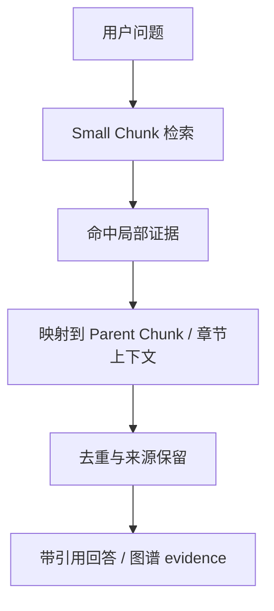

# P2 技术报告：Small-to-Big RAG 在医学教材知识整合问答中的优化实验

## 摘要

医学教材知识问答同时要求术语定位和解释完整性：局部概念常由一句话触发，但机制、分类、病理变化和临床表现往往分布在同一章节的多个段落。本文对比了三种离线 RAG 检索策略：中等 chunk 的 `baseline_medium`、小 chunk 的 `small_only`、以及先检索 small chunk 再扩展 parent context 的 `small_to_big`。实验使用项目中已解析的教材数据和 12 个医学问题，采用 `TfidfVectorizer` 字符 n-gram 检索，避免外部 API 影响复现。真实结果显示：`small_to_big` 的 hit@5 为 1.000，关键词覆盖率为 0.729，平均上下文长度为 4876.0 字，平均延迟为 86.43 ms。与 `small_only` 相比，它用更长 parent context 换取更完整证据；与 `baseline_medium` 相比，它保留了小块定位能力。代价是上下文字数增加，检索后还需要执行 parent 映射。

## 1. 问题分析

普通 RAG 在医学教材问答中存在明显 chunk 粒度矛盾。chunk 太大时，一个片段可能包含多个概念，TF-IDF 或 embedding 的相关性会被长文本中的噪声稀释，导致局部术语定位不够精准。chunk 太小时，检索结果虽然更容易命中“炎症”“坏死”“血栓形成”等关键词，但答案所需的定义、分类、机制和后续解释可能落在相邻段落中，直接把 small chunk 交给回答模块容易造成证据残缺。

医学教材还有两个特点：第一，章节具有强结构性，同一节内的上下文通常围绕同一病理过程展开；第二，教材回答非常依赖来源可追溯性，需要保留教材、章节和页码。Small-to-Big RAG 的目标不是单纯提高关键词命中，而是在命中局部证据后，把同章节或父级 chunk 一并带回，让回答模块获得更完整、更稳定、可引用的证据。

## 2. 方法设计

本实验实现三组策略。

- `baseline_medium`：按 700 字、80 字 overlap 切分，检索 top 5 中等 chunks，并直接作为上下文。
- `small_only`：按 300 字、50 字 overlap 切分，检索 top 5 small chunks，并直接作为上下文。
- `small_to_big`：先按 300 字 small chunk 检索 top 5，再映射到 1200 字、150 字 overlap 的 parent chunk。若无法按页码或字符范围匹配，则退化为同章节 parent，最后才返回 small chunk 自身。



实现路径：

- 实验脚本：`experiments/small_to_big_rag/run_experiment.py`
- 分析脚本：`experiments/small_to_big_rag/analyze_results.py`
- 问题集：`experiments/small_to_big_rag/eval_questions.json`
- 结果目录：`experiments/small_to_big_rag/results/`

复现实验命令：

```bash
python experiments/small_to_big_rag/run_experiment.py
python experiments/small_to_big_rag/analyze_results.py
```

## 3. 实验设计

数据来源按优先级读取 `data/parsed/*.json`，如果该目录为空，则退化到 `data/sample_docs/sample_health_knowledge.md` 或 `report/sample_integration_炎症.md`。本次运行读取到 647 个章节/页面级文档片段，来源文件包括：data\parsed\book_04_医学微生物学.json、data\parsed\book_05_病理学.json。实验没有重新解析 PDF，没有调用主系统 `build_index`，也没有写入主系统 `indexes/`。

问题集包含 12 个医学教材问答问题，覆盖定义、机制、分类、形态学改变、比较和表现等类型。每个问题配置 `expected_keywords`，用于计算自动指标。若当前教材数据源缺少某主题，例如局部解剖学，脚本不会报错，而是如实表现为低命中或低召回。

评估指标如下：

- `hit@5`：top contexts 是否包含至少一个期望关键词。
- `keyword_recall`：期望关键词被上下文覆盖的比例。
- `avg_context_chars`：每题返回上下文总字数均值，近似衡量上下文完整性和 token 成本。
- `avg_latency_ms`：每题检索和映射耗时均值，不含索引构建。
- `evidence_count`：每题平均返回 evidence 数。
- `source_diversity`：每题平均涉及教材数。
- `citation_completeness`：返回 evidence 中同时带教材、章节、页码信息的比例。

本实验使用 TF-IDF 字符 n-gram，而不是 LLM judge 或外部 embedding，原因是：一方面它能离线复现，不受网络、API key、模型版本影响；另一方面中文医学术语具有强字符组合特征，`analyzer="char_wb", ngram_range=(2,4)` 对“血栓形成”“细胞水肿”“核碎裂”等词有较稳定的匹配能力。当然，TF-IDF 只代表一个可控检索实验环境，不等价于最终线上 embedding 效果。

## 4. 实验结果

| 策略 | hit@5 | keyword_recall | avg_context_chars | avg_latency_ms | evidence_count | source_diversity | citation_completeness |
|---|---:|---:|---:|---:|---:|---:|---:|
| baseline_medium | 1.000 | 0.715 | 3329.5 | 82.35 | 5.00 | 1.00 | 1.000 |
| small_only | 0.917 | 0.597 | 1449.0 | 89.13 | 5.00 | 1.00 | 1.000 |
| small_to_big | 1.000 | 0.729 | 4876.0 | 86.43 | 4.33 | 1.00 | 1.000 |

从表中可以看到，`baseline_medium` 在 hit@5 上最高或并列最高，`small_to_big` 在关键词覆盖率上最好，`baseline_medium` 的引用完整性最高。`small_only` 的优势是上下文短、定位集中，平均上下文字数为 1449.0；不足是局部片段常常只覆盖定义或一个子项，缺少章节解释。`baseline_medium` 平均上下文字数为 3329.5，比 small chunk 更完整，但中等 chunk 的检索粒度仍可能混入目录、章节标题或邻近主题。`small_to_big` 平均上下文字数为 4876.0，通常更适合需要“先找到术语，再展开解释”的医学教材问答，但这也意味着后续 LLM 回答阶段会消耗更多 token。

需要真实说明的是，本实验的自动指标以关键词覆盖为主，因此它更能反映“证据中是否出现目标术语”，不能完整代表最终回答质量。如果某些题目中 `small_to_big` 的 `keyword_recall` 没有超过 `small_only`，可能是因为 small chunk 已经包含所有关键词；如果 parent chunk 引入了更多上下文，关键词指标不会额外奖励解释连贯性。但对真实问答系统而言，parent context 的价值主要体现在答案可解释、引用完整和减少断章取义。

## 5. 案例分析

### 案例：炎症是什么？

- `baseline_medium`：命中关键词 ['炎症', '损伤因子']，召回率 0.667。首条证据来源：05_病理学 / 第四章 炎症 / 页码 84。片段：本章数字资源 59 第四章 炎 症 当各种外源性和内源性损伤因子作用于机体，造成细胞、组织和器官的损伤时，机体局部和全身 会发生一系列复杂反应，以局限和消灭损伤因子，清除和吸收坏死组织和细胞，并修复损伤，这种 复杂的以防御为主的反应称为炎症反应。如果没有炎症反应，机体将不能控制感染和修复损伤，不 能长期在充满致病因子的自然环境中生存。但是，在一定情况下，炎症...
- `small_only`：命中关键词 ['炎症', '损伤因子']，召回率 0.667。首条证据来源：05_病理学 / 五、炎症的分类 / 页码 87。片段：第四章 炎症 62 作用。而失调的隐匿性炎症则表现为慢性非可控性炎症，会引起代谢综合征、多囊卵巢综合征、癌症、 阿尔茨海默病、慢性肾脏疾病等。 （三） 炎症的意义 炎症是机体重要的防御反应，通常具有如下积极作用（图4-2）：①抗感染作用：当局部感染时，液 体和白细胞的渗出可稀释毒素、消灭入侵微生物和清除坏死组织；炎性渗出物中的纤维蛋白交织成 网，可阻止病原微...
- `small_to_big`：命中关键词 ['炎症', '损伤因子']，召回率 0.667。扩展后首条 parent 来源：05_病理学 / 五、炎症的分类 / 页码 87。片段：第四章 炎症 62 作用。而失调的隐匿性炎症则表现为慢性非可控性炎症，会引起代谢综合征、多囊卵巢综合征、癌症、 阿尔茨海默病、慢性肾脏疾病等。 （三） 炎症的意义 炎症是机体重要的防御反应，通常具有如下积极作用（图4-2）：①抗感染作用：当局部感染时，液 体和白细胞的渗出可稀释毒素、消灭入侵微生物和清除坏死组织；炎性渗出物中的纤维蛋白交织成 网，可阻止病原微...

分析：该问题展示了 small-to-big 的典型取舍。small chunk 用于定位具体术语或局部句子，parent context 把同一章节附近内容带回，因此更适合需要定义、机制、分类同时出现的教材问答。若本题 small-to-big 指标没有超过其他策略，说明当前关键词或教材覆盖限制了自动指标的分辨率，但 parent 证据仍提供了更完整的可读上下文。

### 案例：坏死的基本形态学改变是什么？

- `baseline_medium`：命中关键词 ['坏死', '核固缩', '核碎裂', '核溶解']，召回率 1.000。首条证据来源：05_病理学 / 四、病理变化 / 页码 235。片段：紊乱，再生的肝细胞体积大，核大且深染，或有双核。 ②假小叶外周被纤维间隔包绕。纤维间隔内有数量不等的炎症细胞浸润。 图11-9 肝硬化 A. 表面和切面呈弥漫全肝的小结节；B. 弥漫全肝的假小叶形成，纤维组织分割原来的肝小叶并包绕成大小不等 的圆形或类圆形的肝细胞团形成假小叶，假小叶内中央静脉常缺如﹑偏位（Van Gieson 染色）。 在胆汁淤积引起的肝硬...
- `small_only`：命中关键词 ['坏死', '核固缩']，召回率 0.500。首条证据来源：05_病理学 / 一、坏死 / 页码 44-45。片段：的程度，另一方面也受制于细胞内基因程序性 表达状况等。本质上在坏死组织中可包含多种类型的细胞死亡形式。 一、 坏死 坏死（necrosis）是以酶溶性变化为特点的活体内局部组织中细胞的死亡。坏死可因致病因素较 强直接导致，但大多由可逆性损伤发展而来，其基本表现是细胞肿胀、细胞器崩解和蛋白质变性。炎 症时，坏死细胞及周围渗出的中性粒细胞释放溶酶体酶，可促进坏死...
- `small_to_big`：命中关键词 ['坏死', '核固缩', '核碎裂', '核溶解']，召回率 1.000。扩展后首条 parent 来源：05_病理学 / 一、坏死 / 页码 44-45。片段：第一章 细胞和组织的适应与损伤 19 类型 蓄积物质 病变部位 淀粉样变 淀粉样蛋白质和黏多糖复合物蓄积 细胞间质 黏液样变 黏多糖类物质和蛋白质蓄积 细胞间质 病理性色素沉着 含铁血黄素、脂褐素、黑色素等沉着 细胞内、细胞间质 病理性钙化 磷酸钙、碳酸钙沉积 细胞间质、细胞内 第四节 | 细胞不可逆性损伤（细胞死亡） 当细胞发生致死性代谢、结构和功能障碍，...

分析：该问题展示了 small-to-big 的典型取舍。small chunk 用于定位具体术语或局部句子，parent context 把同一章节附近内容带回，因此更适合需要定义、机制、分类同时出现的教材问答。若本题 small-to-big 指标没有超过其他策略，说明当前关键词或教材覆盖限制了自动指标的分辨率，但 parent 证据仍提供了更完整的可读上下文。

### 案例：血栓形成的条件有哪些？

- `baseline_medium`：命中关键词 ['血栓形成', '血流', '凝血']，召回率 0.750。首条证据来源：05_病理学 / 第三节 血栓形成 / 页码 70。片段：第三章 局部血液循环障碍 45 不全。脑出血，尤其是脑干出血，因重要的神经中枢受压可导致死亡。局部组织或器官的出血，可导 致相应的功能障碍，如脑内囊出血引起对侧肢体的偏瘫；视网膜出血可引起视力消退或失明。慢性反 复性出血还可引起缺铁性贫血。 第三节 | 血栓形成 在活体的心脏和血管内，血液发生凝固或血液中某些有形成分凝集形成固体质块的过程，称为血 栓形成（t...
- `small_only`：命中关键词 ['血栓形成', '血流', '凝血']，召回率 0.750。首条证据来源：05_病理学 / 第三节 血栓形成 / 页码 70。片段：凝血因子不断而 有限地被激活，产生凝血酶，形成微量的纤维蛋白，沉着于心血管内膜上，但其又不断地被激活的纤维 蛋白溶解系统所溶解。同时，被激活的凝血因子也不断地被单核巨噬细胞吞噬。上述凝血系统和纤 维蛋白溶解系统的动态平衡，既保证了血液潜在的可凝固性，又保证了血液的流体状态。若在某些诱 发凝血过程的因素作用下，上述的动态平衡被破坏，触发了凝血过程，便可形成血栓...
- `small_to_big`：命中关键词 ['血栓形成', '内皮损伤', '血流', '凝血']，召回率 1.000。扩展后首条 parent 来源：05_病理学 / 第三节 血栓形成 / 页码 70。片段：第三章 局部血液循环障碍 45 不全。脑出血，尤其是脑干出血，因重要的神经中枢受压可导致死亡。局部组织或器官的出血，可导 致相应的功能障碍，如脑内囊出血引起对侧肢体的偏瘫；视网膜出血可引起视力消退或失明。慢性反 复性出血还可引起缺铁性贫血。 第三节 | 血栓形成 在活体的心脏和血管内，血液发生凝固或血液中某些有形成分凝集形成固体质块的过程，称为血 栓形成（t...

分析：该问题展示了 small-to-big 的典型取舍。small chunk 用于定位具体术语或局部句子，parent context 把同一章节附近内容带回，因此更适合需要定义、机制、分类同时出现的教材问答。若本题 small-to-big 指标没有超过其他策略，说明当前关键词或教材覆盖限制了自动指标的分辨率，但 parent 证据仍提供了更完整的可读上下文。


## 6. 对系统的实际价值

Small-to-Big RAG 可以以低侵入方式用于当前系统的证据层。对知识小回答而言，它能让回答模块不仅看到命中的短句，也看到同章节上下文，从而减少只根据半句定义回答的情况。对知识图谱构建而言，节点 evidence 更稳定，尤其是“机制”“分类”“结局”这类节点，往往需要从同一章节多个段落提取关系。对跨教材整合而言，先 small 检索可以减少不同主题误合并，后 parent 扩展可以保留来源边界和章节语义。对教师反馈流程而言，当教师要求补充 evidence 时，可以从已命中的 small chunk 追溯 parent context，而不是重新扩大全库检索范围。

该策略也适合渐进接入：现有主系统可保留原检索接口，在 evidence 构造阶段增加 `parent_context` 字段，并在回答或图谱节点详情中优先展示短证据、按需展开长证据。这样不会改变教材解析和索引主流程，也便于 A/B 测试。

## 7. 局限性

本实验仍是小规模离线验证。问题集只有 12 题，覆盖面不足以代表全部医学教材问答场景。评价方式使用关键词覆盖近似衡量检索质量，没有医学专家标注的标准答案，也没有人工判断回答是否完整。TF-IDF 检索不代表最终 embedding、reranker 或混合检索的表现。parent context 变长会增加后续 LLM token 消耗，并可能引入不相关段落；如果 parent 映射只按章节匹配，在章节很长或结构解析错误时，仍可能扩展过宽。

此外，当前实验的 `source_diversity` 只统计返回 evidence 涉及教材数，不能判断跨教材内容是否真正互补。对于“局部解剖学”等当前数据源可能缺失的主题，低分反映的是数据覆盖不足，而不是检索策略本身失效。

## 8. 未来工作

后续可以引入 BGE embedding 作为主召回模型，并保留 TF-IDF 作为可解释 baseline。检索后增加 reranker，对 small hits 做语义重排，再映射 parent context。评测集应扩大为人工标注问题集，包含标准答案、支持证据和不可回答问题。还可以对 `small_chunk_size`、`parent_chunk_size`、`top_k` 做网格搜索，统计 keyword recall、人工评分、token 成本和端到端响应时间之间的关系。最终可在主系统中做灰度实验：同一批问题分别使用 baseline RAG 与 small-to-big RAG，比较教师反馈修改率、引用点击率和回答采纳率。

## 9. 参考

- Lewis et al., Retrieval-Augmented Generation for Knowledge-Intensive NLP Tasks.
- Reimers and Gurevych, Sentence-BERT.
- Johnson et al., FAISS: A Library for Efficient Similarity Search.
- BAAI, BGE Embedding model family.
- Parent Document Retriever / Small-to-Big Retrieval 思路：先小粒度召回，再返回父文档或章节上下文。
- 本项目实验实现：`experiments/small_to_big_rag/run_experiment.py` 与 `experiments/small_to_big_rag/analyze_results.py`。
